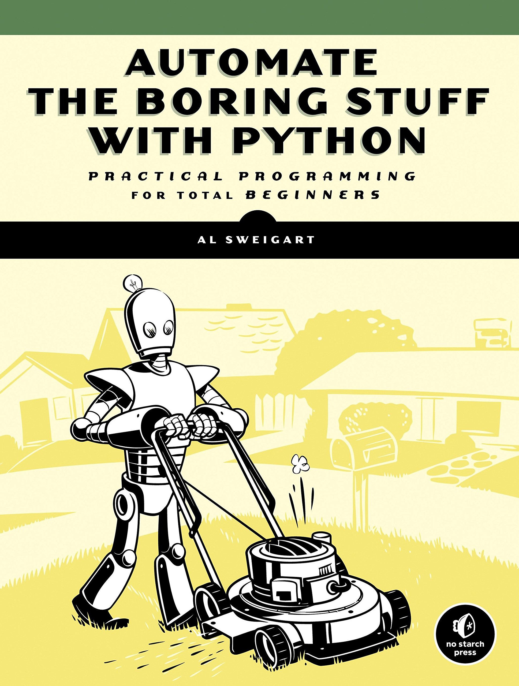

# Automate The Boring Stuff With Python

(Image from Google)

This Repository contains the Code for the Projects in the book 'Automate the Boring Stuff with Python' by Al Sweigart.

# Contents
## What are the contents:
Projects, usually, appear at the end of each chapter, but in some places I found some challenging problem statements within the chapter, which I have included here as well. You can find these code files in the folder corresponding to the chapter.

## How to use this repository: 
The docstrings at the begining of each Python file explains both the problem which the code solves and how it is solved. For some projects there will be different versions, which actually are the different approaches I took to solve the problem.

So, you can either `clone` this repository or `fork` it and then run the Python Files on your local system. 

So far I could upload the projects for Chapters 3, 4 and 5. I will upload the rest as and when I complete reading the chapters and finishing the projects.

So, Stay tuned!